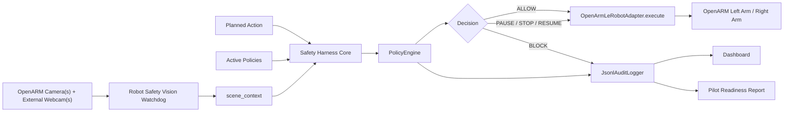

# Robot Safety Harness - Architecture And Workflows

This document describes the current harness architecture inside `/home/rached/robot-safety-watchdog`.

Current development decision:

- Harness work lives in `harness/`.
- The existing watchdog remains the perception layer.
- OpenARM control goes through LeRobot and the harness adapter layer.
- The VLM can enrich logs, but deterministic rules drive safety decisions.

Core principle:

```txt
AI interprets the scene.
Deterministic policies make the safety decision.
```

## 1. Decision Semantics

`ALLOW` and `BLOCK` are pre-execution command-gating decisions:

- `ALLOW`: send the planned OpenARM action to the controller.
- `BLOCK`: do not send the planned OpenARM action.

They are not runtime interruption commands. Once a trajectory is already running, `BLOCK` cannot stop it.

`PAUSE`, `STOP`, and `RESUME` are runtime supervision decisions:

- `PAUSE`: pause inference/control and hold the robot if the controller supports it.
- `STOP`: stop inference and hold or disconnect through the available control surface.
- `RESUME`: resume only after fresh camera frames show the scene is safe.

The camera watchdog keeps running while the robot is paused. Resume decisions are based on fresh frames, not the stale frame that triggered the pause.

## 2. Main Architecture



## 3. Watchdog-To-Harness Mapping

The existing watchdog is the perception layer.

```txt
Watchdog.process_frame(frame)
      v
detections + hands + FrameAnalysis.hits + FrameAnalysis.blades
      v
WatchdogPerceptionAdapter
      v
scene_context for PolicyEngine
```

Concrete mapping:

- `Detection.label`, `Detection.confidence`, `Detection.box`, `Detection.track_id` become object observations.
- `Hand.fingertips` becomes hand evidence.
- Open-vocabulary `HAND_CLASSES` detections become `human_hand` evidence when MediaPipe landmarks are unavailable.
- `FrameAnalysis.hits` becomes harness hazards and max severity.
- `FrameAnalysis.blades` becomes `geometry.sharp_tools[]`: blade tip, axis, angle, length, and elongation.

## 4. Command-Gating Workflow

Command gating is used when the harness knows the intended action before execution.

```txt
planned_action + current camera frame
      v
WatchdogPerceptionAdapter
      v
PolicyEngine
      v
ALLOW or BLOCK
      v
execute action or skip action
```

Minimum proof:

```txt
BLOCK => OpenARM does not move because the action is never sent.
ALLOW => OpenARM executes the wrapped action.
```

## 5. Runtime Watchdog Workflow

Runtime supervision is used while the robot is already active.

```txt
camera frame
      v
watchdog geometry/rules
      v
PolicyEngine
      v
PAUSE / STOP
      v
OpenArmLeRobotAdapter
      v
LeRobotOpenArmController
      v
inference pause/stop + send hold action or disconnect
```

The fast rule shape is:

```python
if (
    tip_to_fingertip_distance_px <= blade_tip_to_hand_px
    and tip_aimed_at_hand
):
    decision = "PAUSE"
```

`RuntimeWatchdogSupervisor` tracks `RUNNING`, `PAUSED`, and `STOPPED` state. It calls `pause` once on transition and calls `resume` only after several safe frames.

## 6. LeRobot Main Findings

LeRobot `main` was inspected at commit `3dd19d043e2f3fe5673b13ea0ebe4f31884c0797`.

Relevant APIs:

- `Robot` base class defines `connect`, `get_observation`, `send_action`, and `disconnect`.
- `OpenArmFollower.send_action(action, custom_kp=None, custom_kd=None)` sends `.pos` motor goals with joint-limit clipping.
- `OpenArmFollower.disconnect()` disconnects the CAN bus and cameras.
- `BiOpenArmFollower.send_action(action, ...)` splits `left_` and `right_` action keys and calls each arm.
- `InferenceEngine` defines optional `pause()` and `resume()` hooks.
- RTC inference implements `pause()` and `resume()`.
- DAgger mode uses `engine.pause()`, sends the last action to hold position while paused, then resets/resumes inference.

Current conclusion:

- OpenARM robot classes do not expose a standard robot-level `pause()` or `resume()` on `main`.
- The harness therefore provides `LeRobotOpenArmController`.
- `pause()` pauses inference if available, reads current `.pos` observations, and sends a hold action through `send_action`.
- `resume()` resets the interpolator/inference if available, then resumes inference.
- `stop()` stops inference and either holds the current pose or disconnects depending on `stop_mode`.

## 7. OpenARM Two-Arm Cell

The two OpenARM arms are treated as one controlled robot cell by default.

```txt
OpenARM Cell
  left_arm
  right_arm
  shared_workspace
  external_webcam_1
  optional_external_webcam_2
  safety_harness
```

Rules:

- Known planned actions should include `arm`.
- If the watchdog has no trusted action metadata, treat both arms as possible contributors to the risk.
- Runtime `PAUSE` and `STOP` should target `both_arms` unless safe per-arm isolation is validated.
- Logs should state `left_arm`, `right_arm`, or `both_arms`.

## 8. Demo Scenarios

Scenario 1, block before execution:

```txt
OpenARM plans to pick sharp_tool with left_arm.
A human hand is near the tool.
PolicyEngine returns BLOCK.
OpenArmLeRobotAdapter.execute is not called.
```

Scenario 2, allow after mitigation:

```txt
The hand leaves the workspace.
The same action is retried.
PolicyEngine returns ALLOW.
OpenARM executes the action.
```

Scenario 3, runtime interruption:

```txt
OpenARM is already moving.
The watchdog keeps analyzing camera frames.
The blade tip becomes close to and aimed at a hand.
PolicyEngine returns PAUSE.
RuntimeWatchdogSupervisor calls robot.pause().
The camera keeps running.
After several safe frames, robot.resume() is called if auto-resume is enabled.
```

## 9. Definition Of Done

The demo satisfies the architecture if:

- `BLOCK` prevents the wrapped OpenARM action from being sent.
- `ALLOW` sends the wrapped OpenARM action.
- `PAUSE` or `STOP` affects both arms, or the API limitation is documented.
- Cameras keep running during `PAUSED`.
- `RESUME` happens only after fresh safe frames and preferably operator approval.
- Decisions come from `PolicyEngine`, not dashboard state.
- The VLM is not on the critical stop path.
- Every decision is logged with scene evidence and robot command result.
