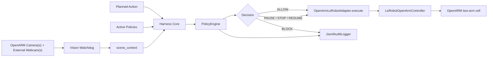

# Robot Safety Harness - Technical Product Spec

## 1. Product Thesis

Robot Safety Harness is a runtime safety layer for robotics pilots.

It observes the workspace, checks robot actions against deterministic policies, prevents unsafe actions before execution, pauses or stops unsafe runtime behavior when the robot exposes a control surface, logs every decision, and produces pilot-readiness evidence.

Core claim:

```txt
AI interprets the scene.
Deterministic policies make the safety decision.
```

Do not claim:

- The model autonomously decides whether the robot is safe.
- The harness verifies neural network weights.
- The harness certifies a learned robot policy.
- The harness can stop a robot that exposes no API, pause/stop method, safe-hold behavior, or hardware interlock.

## 2. Current Codebase Alignment

Existing watchdog:

- `src.watchdog.Watchdog.process_frame(frame, now)` is the perception entry point.
- It returns `detections`, `hands`, and `src.rules.FrameAnalysis`.
- The current `main` detector can use YOLOE open-vocabulary prompts, including `hand`, so the harness treats `HAND_CLASSES` as `human_hand` even when MediaPipe is unavailable.
- `FrameAnalysis.hits` contains deterministic rule hits.
- `FrameAnalysis.blades` contains PCA-derived blade geometry.

Harness package:

- `harness.models`: dataclasses for actions, policies, decisions, and command results.
- `harness.perception.WatchdogPerceptionAdapter`: watchdog outputs to `scene_context`.
- `harness.policy.PolicyEngine`: deterministic policy engine.
- `harness.robot.OpenArmLeRobotAdapter`: generic OpenARM control adapter.
- `harness.robot.LeRobotOpenArmController`: LeRobot `main` OpenARM shim.
- `harness.runtime.RuntimeWatchdogSupervisor`: continuous pause/stop/resume supervision while cameras keep running.
- `harness.core.safe_execute`: command-gating entry point.
- `harness.logger.JsonlAuditLogger`: JSONL audit logging.

## 3. Decision Semantics

Use `BLOCK` / `ALLOW` for pre-execution command gating:

- `BLOCK`: do not send the planned OpenARM action to LeRobot.
- `ALLOW`: send the planned OpenARM action to LeRobot.

Use `PAUSE` / `STOP` / `RESUME` for runtime interruption:

- `PAUSE`: pause inference/control and hold current robot pose.
- `STOP`: stop inference and hold or disconnect.
- `RESUME`: resume only when fresh camera frames show that the workspace is safe.

`BLOCK` is not a kill switch once a trajectory is already running.

## 4. Demo Contract

Minimum command-gating proof:

```txt
OpenARM planned action + live frame + active policies
      v
safe_execute
      v
BLOCK or ALLOW
      v
action skipped or action sent
```

Minimum runtime-interruption proof:

```txt
OpenARM already moving
      v
camera watchdog keeps running
      v
hazard detected
      v
PAUSE or STOP
      v
LeRobot pause/hold or stop/hold/disconnect
      v
safe frames observed
      v
RESUME if allowed
```

## 5. System Architecture



## 6. Scene Context

`WatchdogPerceptionAdapter` converts current watchdog outputs into this shape:

```json
{
  "camera_id": "external_webcam_1",
  "objects": ["sharp_tool", "human_hand"],
  "geometry": {
    "sharp_tools": [
      {
        "track_id": 3,
        "blade_axis_degrees": 34.5,
        "blade_tip_px": [612, 284],
        "nearest_fingertip_px": [641, 292],
        "tip_to_fingertip_distance_px": 30,
        "tip_aim_angle_deg": 12.0,
        "tip_aimed_at_hand": true
      }
    ]
  },
  "zones": {
    "human_in_workspace": true,
    "tool_in_active_zone": true
  },
  "hazards": ["blade_tip_near_hand", "blade_tip_aimed_at_hand"],
  "max_rule_severity": "critical",
  "confidence": 0.86
}
```

Pixel distances and aim angles are internal rule signals. Do not claim certified physical distance without calibration.

## 7. Policy Engine

Implemented policies:

- `P1 - Human Proximity Around Hazardous Tool`: returns `BLOCK` for planned manipulation of a sharp tool when a human is in an unsafe relation to it.
- `P1W - Blade Tip Aimed Near Hand`: returns `PAUSE` when the observed blade tip is close to and aimed at a hand.

The VLM can enrich logs, but it must not be required before a stop or pause decision.

## 8. LeRobot Main Integration

LeRobot `main` was inspected at commit `3dd19d043e2f3fe5673b13ea0ebe4f31884c0797`.

Relevant findings:

- `Robot` exposes `connect`, `get_observation`, `send_action`, and `disconnect`.
- `OpenArmFollower.send_action()` sends position goals.
- `BiOpenArmFollower.send_action()` splits `left_` and `right_` action keys.
- OpenARM robot classes do not expose a standard robot-level `pause()` / `resume()` on `main`.
- Inference engines expose optional `pause()` / `resume()` hooks.
- RTC inference implements those hooks.
- DAgger provides the best reference behavior: pause inference, keep sending the last/hold action, then reset/resume inference.

The harness implementation follows that pattern:

```python
from harness import LeRobotOpenArmController, OpenArmLeRobotAdapter

controller = LeRobotOpenArmController(
    robot=openarm_robot,
    inference_engine=policy_inference_engine,
    interpolator=action_interpolator,
    stop_mode="hold",
)
robot = OpenArmLeRobotAdapter(controller=controller)
```

`LeRobotOpenArmController.pause()`:

- calls `inference_engine.pause()` when available;
- reads `robot.get_observation()`;
- extracts current `.pos` keys;
- sends that hold action through `robot.send_action()`.

`LeRobotOpenArmController.resume()`:

- resets the interpolator when available;
- resets and resumes the inference engine when available.

`LeRobotOpenArmController.stop()`:

- calls `inference_engine.stop()` when available;
- either holds current pose or disconnects, depending on `stop_mode`.

## 9. OpenARM API Expectations

For command gating, expose one of:

- `execute(planned_action_dict)`
- `run_action(planned_action_dict)`
- `send_action(action_dict)`
- `play_trajectory(trajectory)`
- `replay_trajectory(trajectory)`

For runtime interruption, expose or wrap:

- `pause(affected_arm="both_arms")`
- `resume(affected_arm="both_arms")`
- `stop(affected_arm="both_arms")`
- `emergency_stop()`
- `disconnect()`
- safe-hold via `send_action(current_position_action)`

## 10. Event Log

Each decision should log:

- timestamp;
- planned action when available;
- affected arm;
- scene context;
- geometry evidence;
- violated policy;
- decision;
- mitigation;
- evidence frame ID;
- robot command result;
- VLM audit rationale when available.

## 11. Definition Of Done

The harness demo is valid if:

- `BLOCK` prevents a wrapped OpenARM action from being sent.
- `ALLOW` sends the wrapped OpenARM action.
- `PAUSE` pauses inference/control and sends a hold action or validated safe-hold command.
- Cameras keep running while paused.
- `RESUME` only happens after fresh safe frames and ideally operator approval.
- `STOP` behavior is explicit: hold or disconnect.
- Decisions come from `PolicyEngine`, not dashboard state.
- The VLM is not on the critical stop path.
